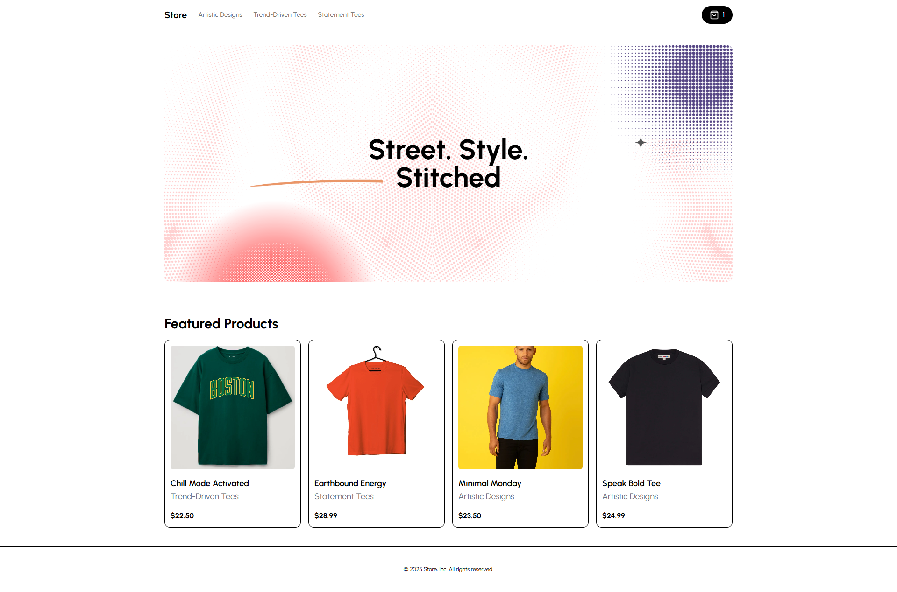
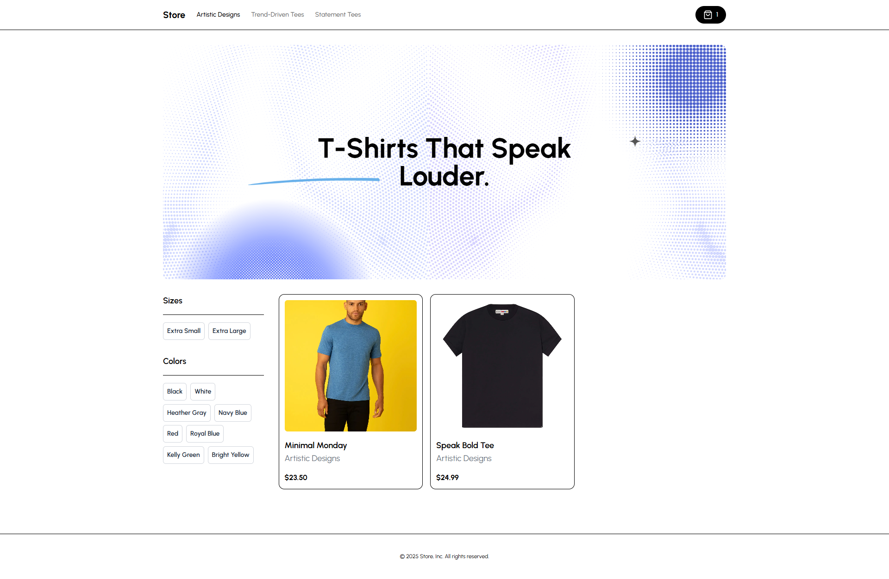
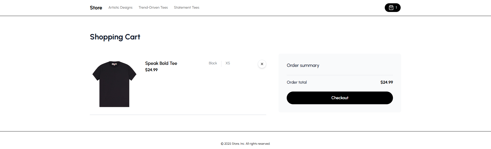
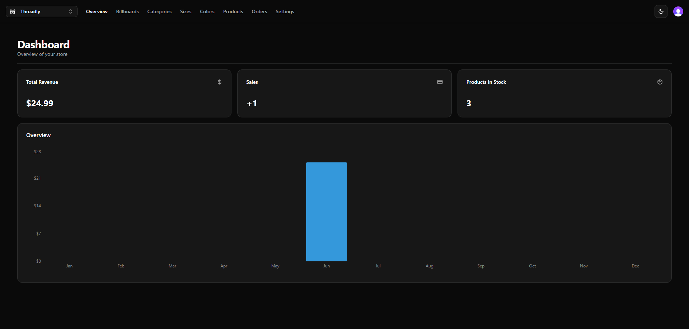
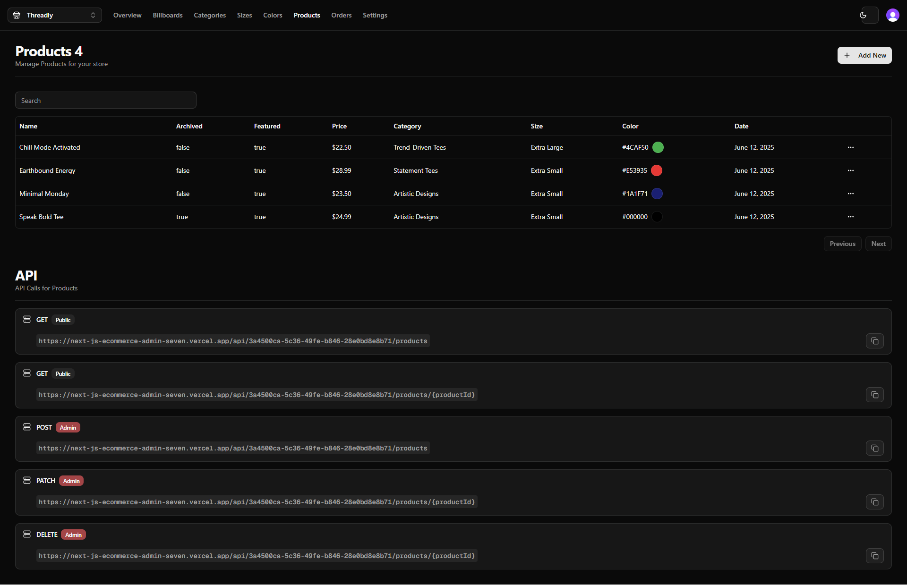

# Next.js E-commerce Platform with Admin Dashboard

A modern, full-featured e-commerce platform built with Next.js, featuring both customer-facing storefront and admin dashboard.

## 🚀 Features

### Customer Storefront
- Responsive and modern UI design
- Product catalog with search and filtering
- Shopping cart functionality
- Secure checkout process
- Order tracking
- Product Filters

### Admin Dashboard
- User authentication
- Product Search
- Comprehensive analytics dashboard
- Product management (CRUD operations)
- Order management and tracking
- Customer management
- Sales reports and analytics

## 🛠️ Tech Stack

- **Frontend Framework:** Next.js
- **Styling:** Tailwind CSS
- **State Management:** Zustand
- **Database:** PostgreSQL
- **Authentication:** Clerk Auth
- **Payment Processing:** Stripe
- **Image Storage:** Cloudinary
- **Deployment:** Vercel

## 📸 Screenshots

### Store Home Page

*Modern and responsive store homepage*

*Category Page*

*Checkout Page*

### Admin Dashboard

*Admin dashboard with key metrics*

*Published Products*

